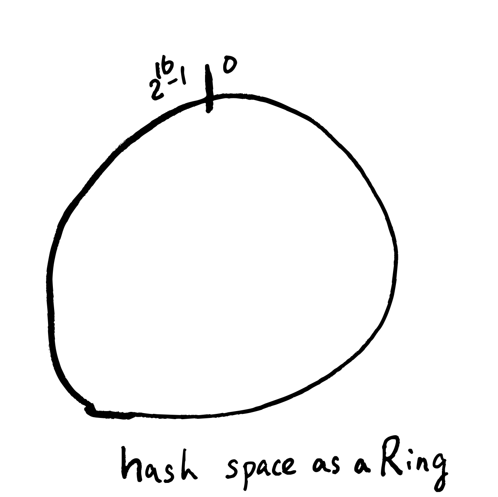
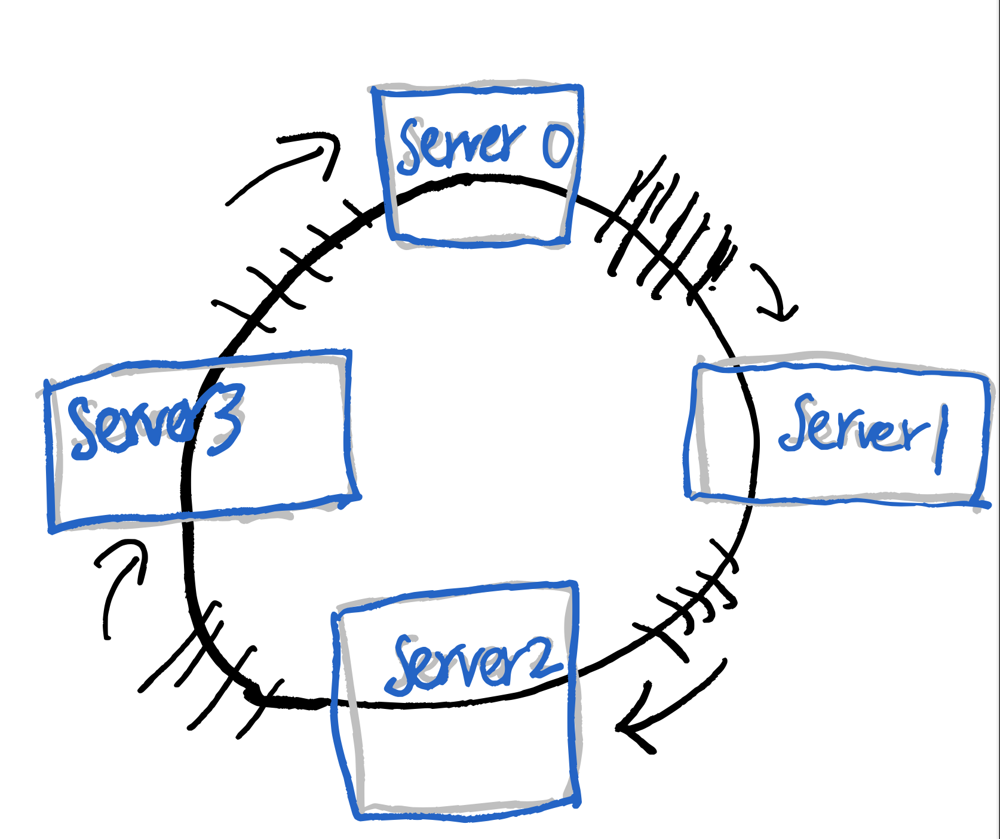
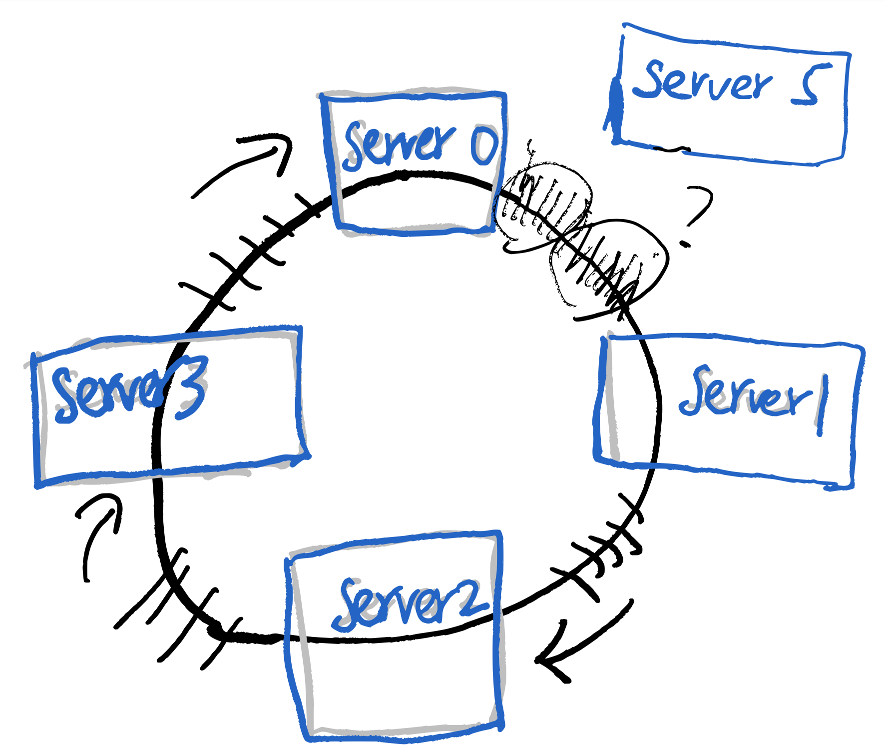

_主要從之前在17 Live的內部分享過的投影片整理出內容。_

# 問題1: 平均分配
假設我們有巨量的資料要處理，一台機器是處理不來的，所以我們需要很多很多台機器(N台)來處理，那接下來的問題就是，要怎麼把這些資料平均分配給這N台機器來處理？

為了具象化這個情境(但不失一般性)，以下都假設我們使用了N台 cache server (`memcahed`)，這些server的編號從0, 1, 2, … 到 N-1 。然後每筆資料都有其獨一無二的`key`。

所以，我們需要一個好的hash function，這個hash function會把 `key` 平均對應到 0 到 N-1 的正整數。 

## 方法：取餘數法 (mod N)
`Hash(key) mod N` ，這個結果必為 0 到 N-1 的數，也就決定了要讓哪台server來處理。

這個方法簡單粗暴，缺點是 mod N 的平均分配效果取決於N本身的一些性質(是否為質數等等)，但在實務上應該也是堪用了。

# 問題2: 動態增減機器
當資料量增加的時候，我們必須增加足夠的機器去處理，當資料量減少的時候，我們當然也希望減少機器以節省成本。在我們cache server的情境中，我們最不想看到的就是當增減機器的時候，產生大量的cache miss，所以我們定義以下的需求：

對一個N台機器的cluster，增減一台機器的時候，只能影響約`1/N+1`的 cache key

舉例來說，假如原先有4台機器。而現在要變成5台機器，那新的那台機器，要負責`1/5`的資料量，而且這`1/5`資料量的來源，要平均的來自其他4台機器。

取餘數法在這個情境是不適用的，因為當server的數量從N變到N+1，幾乎大部分cache key所對應到server都會有所改變，無法達到只影響1/N的需求。

也就是說，我們需要一個consistent的 hash function，當N變成N+1的時候，大部分的 key 對應的編號都是不變的，只改變了其中約 1/N 的key的編號。

## Ring-based Consistent Hash

### 歷史
Akamai 公司在1997年的時候，發表了: [Consistent Hashing and Random Trees: Distributed Caching Protocols for Relieving Hot Spots on the World Wide Web](https://www.akamai.com/site/en/documents/research-paper/consistent-hashing-and-random-trees-distributed-caching-protocols-for-relieving-hot-spots-on-the-world-wide-web-technical-publication.pdf)。

到了2007年，Amazon的DynamoDB，在DB partitioning的部分，提到他們使用了consistent hash 的演算法；而在同年，last.fm 的工程師發表了著名的 [Ketama](https://github.com/RJ/ketama) 實現，之後 consistent hash 就被廣泛運用到web backend的各個領域了。 


### 概念
Ring-based的想法首先是把Hash function 的output想成一個環，然後每個server負責這個環的一部分(守備範圍)，如圖所示：


假如我們需要多一台server的話，因為不想要影響太多原有的守備範圍，可能會想把這個新server插在某兩個server的中間，但假如這個做的話，會很明顯的看出server loading不一致的問題。

_server5 和 server1 的 loading是其他server的一半_

接下來，我們引進virtual node 的概念來解決這個問題，想像每個server各自對應到n個環上的virtual node，這些virtual node平均的分佈在環上，當我們新增刪除server的時候，就是把一大串對應的virtual node新增刪除而已，因為virtual node是平均分佈的，所以對loading影響不大，也不會讓每個server的守備範圍有大幅變動。

### 實現

試著理解code的話，可以對整個演算法有更好的掌握。

```go
func (m *Map) Add(nodes ...string) {

    for _, n := range nodes {

        for i := 0; i < m.virtualNodes; i++ {

            hash := int(m.hash([]byte(strconv.Itoa(i) + " " + n)))
            m.circle = append(m.circle, hash)

            m.hashMap[hash] = n
        }
    }
    sort.Ints(m.circle)
}
```

不管是新增或刪除node，我們都會重新呼叫這個`Add`function，來建立virtual node與server之間的對應。
在這個function 中有兩個重要的變數：

-  `m.circle`: 從小到大排序好的 virtual nodes
- `m.hashMap`: 每一個virtual node對應到的server

```go
func (m *Map) Get(key string) string {
    hash := int(m.hash([]byte(key)))

    idx := sort.Search(len(m.nodes), 

        func(i int) bool { return m.nodes[i] >= hash }

    )
    if idx == len(m.nodes) {
        idx = 0
    }

    return m.hashMap[m.nodes[idx]]
}
```

給定一個 key，如何找到要處理這個key的Server呢？在這個`Get` function裡，我們可以看到，就是做[binary search](https://pkg.go.dev/sort#Search)，找到最接近的virtual node，再透過hashMap反查回實體server。

以上code來自於[https://github.com/serialx/hashring](https://github.com/serialx/hashring)

## Jump Consistent Hash

Google在2014年的時候，提出了[Jump Consistent Hash](https://arxiv.org/ftp/arxiv/papers/1406/1406.2294.pdf)，巧妙的利用了[水塘抽樣(Reservoir sampling)](https://en.wikipedia.org/wiki/Reservoir_sampling)的概念，設計出了一個相較於Ring-based，更快，記憶體使用量更少的Consistent Hash。

首先我們先用[Leetcode 382: Linked List Random Node](https://leetcode.com/problems/linked-list-random-node/description/)，來解釋水塘抽樣的概念。現在我們有一個未知長度的singly linked list，需要從這個linked list中，隨機的返回其中一個node的值，而且，選擇任何一個node的機率都要是一樣的。此外，我們需要這個演算法是1-pass，且space complexity 為常數。

因此，我們可以利用隨機演算法的力量：

1. 先取node 1 的值
2. 接下來到node 2，我們有1/2 的機率改取node 2的值。

到這邊先停一下，這兩步執行完之後，很明顯有1/2的機率是取node 1，1/2的機率是取node 2。
然後再考慮node 3，我們設定有1/3的機率取node 3的值，也就是說，有2/3的機率是取到node 1或node 2，然後我們取到node 1和node 2的機率又是相等的，於是就變成前3個node的機率都是1/3。
以此類推，我們有1/4的機率換成node 4，有1/5的機率換成node 5.......有1/n的機率換成node n。

每走一步，有 1/n 的機率會改變，對比跟consitent hashing的要求：對一個N台機器的cluster，增減一台機器的時候，只能影響約1/N+1的 cache key，是不是非常相似？！

所以，我們就有了Jump Consistent Hash version 1：
```c
int ch(int key, int N) {

    random.seed(key);

    int b = 0;

    for (int j = 1; j < N; j++) {

        if (random.next() < 1.0 / (j + 1))

            b = j;

    }

    return b;
}

```

把 `key`做為random seed，我們可以固定每個key最終會落在哪個server。
這個version 1的時間複雜度是O(N)，

在version 1，我們觀察到以下機率的性質：首先，在這個迴圈中，`b`改變的機率隨著`j`變大，其實是很小的: (1/j+1)。

也就是可以假設從 1, 2, 3, …, *b*, *b+1*, …., *j*, j+1, …. N-1 中，從*b+1*, …*j* 這段都沒改變它的值，都維持在`b`。這樣的機率是 (b+1)/j

$$ \frac{b+1}{b+2} \times \frac{b+2}{b+3} \cdots \times \frac{j-1}{j} $$

所以，計算一次隨機數r，從 r \<= (b+1) / j 的不等式中，推出 j \<= floor(b+1/r)，然後便能寫出以下的code：

```c
int ch(int key, int num_buckets) {

    random.seed(key);

    int b = -1;
    int j = 0;

    while (j < num_buckets) {
        b = j;
        double r = random.next();
        j = floor((b + 1) / r);
    }

    return b;
}
```

這就是 jump consistent hash中，_jump_ 的由來，透過計算一次隨機數，就可以往前 _jump_ ，比原來的一步一步走快多了。

在原論文中，針對偽隨機的部分，提出了更進一步的優化，所以有了最終版本：
```c
int32_t JumpConsistentHash(uint64_t key, int32_t num_buckets {

    int64_t b = -1
    int64_t j = 0;

    while (j < num_buckets) {
        b = j;
        key = key * 2862933555777941757ULL + 1;
        j = (b + 1) * (double(1LL << 31) / double((key >> 33) + 1));

    }

    return b;
}
```


### 缺點
Jump Consistent Hash 有著簡潔的實現，從機率上也得到更好的均勻分布，但在實務上，它還是有著一些缺點：首先，必須保存一個 server name 對 index 的對應，因為在consistent hash中，server一律是用number來表示的。

接下來要從中間移除一個server是不可行的，因為這樣會讓編號中間空出一個，我們對中間的node只能做replace，而新增刪除node只能從尾端(tail)做起。相對來說，Ring-based Consistent Hash 只是去移除對應的 virtual nodes，就彈性了許多。

從這點考慮，Jump Consistent Hash 比較適合node 不會劇烈改變的環境，例如database storage。

# 問題3：hot key (rebalance)
在之前的故事中，我們成功的把key一視同仁的分散到每個機器去處理了，可惜的是，在真實世界中，有些key就是比其他的key熱門，這些hot key的存在，會讓部分cache server的loading遠高於其他server，因此，我們必須做適當的rebalance，再次分散存在hot key的server的loading。

## Etsy case：cache smearing
Etsy 在這篇[How Etsy caches: hashing, Ketama, and cache smearing](https://www.etsy.com/codeascraft/how-etsy-caches)中，解釋了他們如何處理在 memcached cluster 遇到的 hot key 問題。

Etsy使用了consistent hash，將要做http cache的資料分散給不同memcached server去處理，可以想見的是，有些http頁面就是比其他頁面還要熱門許多，所以產生了hot key 問題。

對於hot key問題，Etsy使用了一種他們稱為cache smearing的技巧，這個技巧是這樣的：假如現在我們已經知道有一個hot key為`popular_key`，我們就把這個key duplicate幾份：`popular_key_1, popular_key_2, popular_key_3... popular_key_16 `，這些key全部對應到相同的內容，也就是將1個hot key變成多個key，處理hot key內容的server變多了，也就減緩了hot key帶來的影響。

在實務上，Etsy使用mctop去監控memcached cluster，並將觀測到的hot key手動加入到一個cache smearing清單裡。

## Redis Cluster: Hash Slots
在Redis Cluster 的架構中，Redis 提出了一種更加彈性的作法(但也需要更多的人為操作)。

首先，Redis利用CRC演算法，劃分出了16384個**slots**，也就是說，每一個cache_key經過CRC演算法後，就可以知道要由哪一個slot負責處理。
重點是這些slots是虛擬的，使用者可以進一步控制哪些slots要由哪些實體機器來處理，

也就是說，當我們觀測到hot key問題的時候，是可以藉由手動重新分配slots到不同的機器上來解決的。


## Consistent Hashing with Bounded Loads

對於 hot key 問題，Google 提出了另外一種作法：[Consistent Hashing with Bounded Loads](https://ai.googleblog.com/2017/04/consistent-hashing-with-bounded-loads.html)。

這個作法是基於ring-based consistent hash：首先我們監控每台server的loading，並設置每台server的loading上限，現在假設這個上限是125%，
當有一台server A他的loading超過每台server平均的loading百分之25的時候，就會啟動bounded loads的機制。

這個機制就是，接下來原本要給A處理的key，會轉給沿著ring順時鐘方向，下一個virtual node對應的實體server來處理，藉此來分散loading。

進一步分析這個演算法，可以得到下面三個好處：

1. 沒有任何server超過loading的話，就是一般的ring-based consistent hashing。
2. 對相同key來說，它的fallback server是一致的。
3. 對不同key來說，它的fallback server是不一樣的。

Vimeo 把這個演算法實作在 HAProxy 上，作為其load balancer機制的其中一個選項。根據Vimeo的[測試](https://medium.com/vimeo-engineering-blog/improving-load-balancing-with-a-new-consistent-hashing-algorithm-9f1bd75709ed)，loading上限設置在125%～200%中，都有不錯的效果。 

# 結語

這篇文章主要介紹了 consitent hash 的概念，以及相關的演算法，如以下：

- ring-based consitent hashing
- jump consistent hashing
- redis hash slots
- consistent hash with bounded loads

